# Java Docker AWS Webapp

A lightweight IoC web framework built from scratch in Java, featuring annotation-based routing via reflection, concurrent request handling with a thread pool, and graceful shutdown. Deployed using Docker and AWS EC2.

---

## Table of Contents

1. [Project Summary](#1-project-summary)
2. [Architecture](#2-architecture)
3. [Class Design](#3-class-design)
4. [Project Structure](#4-project-structure)
5. [Prerequisites](#5-prerequisites)
6. [Build and Run Locally](#6-build-and-run-locally)
7. [Docker — Local Deployment](#7-docker--local-deployment)
8. [DockerHub](#8-dockerhub)
9. [AWS EC2 Deployment](#9-aws-ec2-deployment)
10. [Available Endpoints](#10-available-endpoints)
11. [Concurrency](#11-concurrency)
12. [Graceful Shutdown](#12-graceful-shutdown)
13. [Tests](#13-tests)
14. [Deployment Demo — Video](#14-deployment-demo--video)

---

## 1. Project Summary

This project is the evolution of the previous IoC web framework workshop. It extends the framework with two key improvements required for production-grade deployments:

- **Concurrent request handling** using a fixed thread pool (`ExecutorService`), replacing the previous sequential single-threaded model.
- **Graceful shutdown** via a JVM `ShutdownHook` that waits for in-flight requests to complete before stopping the server.

The application is containerized with Docker and deployed on an AWS EC2 instance, pulling the image from DockerHub.

---

## 2. Architecture
```
┌─────────────────────────────────────────────────────────────────┐
│                        Docker Container                         │
│                                                                 │
│   ┌─────────────┐     ┌──────────────────────────────────────┐  │
│   │  HttpServer │     │           IoC Engine                 │  │
│   │             │     │                                      │  │
│   │ ServerSocket│     │  ComponentScanner                    │  │
│   │  port 8080  │     │  - Scans classpath at startup        │  │
│   │             │     │  - Finds @RestController classes     │  │
│   │ ExecutorSvc │     │  - Registers @GetMapping methods     │  │
│   │ 10 threads  │     │  - Builds route map via Reflection   │  │
│   │             │     │                                      │  │
│   │ ShutdownHook│     │  Route Registry                      │  │
│   │  (SIGTERM)  │     │  Map<path, handler>                  │  │
│   └──────┬──────┘     └──────────────┬───────────────────────┘  │
│          │                           │ registers at startup      │
│          │            ┌──────────────▼───────────────────────┐  │
│          │            │           Controllers                 │  │
│          ├───────────►│  HelloController    @RestController   │  │
│          │            │  GreetingController @RestController   │  │
│          │            │  MathController     @RestController   │  │
│          │            └──────────────────────────────────────┘  │
│          │                                                       │
│          │            ┌──────────────────────────────────────┐  │
│          └───────────►│  StaticFileService  (webroot/)        │  │
│                       └──────────────────────────────────────┘  │
└─────────────────────────────────────────────────────────────────┘
        ▲                                │
        │   HTTP Request                 │  HTTP Response
        └───────────────────────────────┘
                   Browser / curl
```

**How it works:**

At startup, `ComponentScanner` scans the classpath using Java Reflection, finds all classes annotated with `@RestController`, reads their `@GetMapping` methods, and registers each one as a route handler in `HttpServer`. This happens once before the server starts accepting connections.

Once running, `HttpServer` accepts incoming connections on port 8080. Instead of handling each request sequentially, it immediately delegates each connection to a worker thread from the `ExecutorService` thread pool (size 10). This allows up to 10 requests to be processed in parallel.

Each worker thread parses the HTTP request, looks up the matching route handler, invokes the controller method via reflection, and writes the HTTP response back to the client. If no route matches, `StaticFileService` attempts to serve a static file from `webroot/`.

When a termination signal (`SIGTERM`) is received for example from `docker stop` — the JVM activates the registered `ShutdownHook`. This hook stops the accept loop, calls `threadPool.shutdown()`, and waits up to 5 seconds for in-flight requests to finish before the process exits.

---

## 3. Class Design
```
┌─────────────────────┐
│   MicroSpringBoot   │
│─────────────────────│
│ +main(args)         │
└──────────┬──────────┘
           │ uses
     ┌─────┴──────┐
     │            │
     ▼            ▼
┌────────────┐  ┌──────────────────────────────────────────────┐
│ HttpServer │  │              ComponentScanner                │
│────────────│  │──────────────────────────────────────────────│
│ -getRoutes │  │ +scanAndRegister()                           │
│ -threadPool│  │ +registerByName(className)                   │
│ -running   │  │ -registerController(cls)                     │
│ -port      │  │ -resolveArgs(method, req)                    │
│────────────│  │ -findControllers()                           │
│ +port(p)   │  └──────────────┬───────────────────────────────┘
│ +get(path) │                 │ reads annotations
│ +start()   │       ┌─────────┼─────────┐
│ -handle()  │       ▼         ▼         ▼
│ -write()   │  ┌─────────┐ ┌──────────┐ ┌─────────────┐
└─────┬──────┘  │@RestCon-│ │@GetMap-  │ │@RequestParam│
      │         │troller  │ │ping      │ │             │
      │         │(class)  │ │(method)  │ │(parameter)  │
      │         └─────────┘ └──────────┘ └─────────────┘
      │
      │ uses                      Controllers (@RestController)
      ├──────────────────┐       ┌──────────────────────────┐
      │                  │       │  HelloController          │
      ▼                  ▼       │  +index()                 │
┌───────────┐   ┌──────────────┐ │  +hello()                 │
│HttpParser │   │StaticFile    │ ├──────────────────────────┤
│───────────│   │Service       │ │  GreetingController       │
│+parse(in) │   │──────────────│ │  +greeting(name)          │
└─────┬─────┘   │+tryServe(p)  │ │  +greetingWithCount(name) │
      │         └──────┬───────┘ ├──────────────────────────┤
      │                │         │  MathController           │
      ▼                ▼         │  +pi()                    │
┌───────────┐   ┌──────────────┐ │  +euler()                 │
│HttpRequest│   │  MimeTypes   │ │  +square(num)             │
│───────────│   │──────────────│ └──────────────────────────┘
│-method    │   │+fromFilename │
│-path      │   └──────────────┘
│-params    │
│-headers   │   ┌──────────────────┐
│-body      │   │ QueryStringParser│
│───────────│   │──────────────────│
│+getParam()│   │ +parse(query)    │
└───────────┘   └──────────────────┘
```

**Key design decisions:**

- `HttpServer` is the core of the framework. It owns the thread pool and the route registry, and orchestrates the full request-response cycle.
- `ComponentScanner` is the IoC engine. It uses Java Reflection to discover controllers and register their methods as route handlers automatically no manual registration needed.
- The three annotations (`@RestController`, `@GetMapping`, `@RequestParam`) are the public API of the framework. Any class annotated correctly will be picked up and served automatically.
- `HttpRequest` is an immutable value object. It is created once per request by `HttpParser` and passed through the handling chain.
- `StaticFileService` and `MimeTypes` are utility classes with no state, responsible only for serving files from the classpath.

---

## 4. Project Structure
```
java-docker-aws-webapp/
├── src/
│   ├── main/
│   │   ├── java/edu/eci/tdse/
│   │   │   ├── MicroSpringBoot.java
│   │   │   ├── annotation/
│   │   │   │   ├── GetMapping.java
│   │   │   │   ├── RequestParam.java
│   │   │   │   └── RestController.java
│   │   │   ├── controller/
│   │   │   │   ├── GreetingController.java
│   │   │   │   ├── HelloController.java
│   │   │   │   └── MathController.java
│   │   │   ├── ioc/
│   │   │   │   └── ComponentScanner.java
│   │   │   └── server/
│   │   │       ├── HttpServer.java
│   │   │       ├── HttpParser.java
│   │   │       ├── HttpRequest.java
│   │   │       ├── MimeTypes.java
│   │   │       ├── QueryStringParser.java
│   │   │       └── StaticFileService.java
│   │   └── resources/webroot/
│   │       ├── index.html
│   │       ├── app.js
│   │       └── style.css
│   └── test/java/
│       ├── ComponentScannerTest.java
│       ├── GreetingControllerTest.java
│       ├── HttpServerConcurrencyTest.java
│       ├── MimeTypesTest.java
│       ├── QueryStringParserTest.java
│       └── RequestTest.java
├── images/
├── Dockerfile
├── docker-compose.yml
└── pom.xml
```

---

## 5. Prerequisites

- Java 21
- Maven 3.8+
- Docker Desktop
- AWS account with an EC2 instance running Amazon Linux 2023
- DockerHub account

---

## 6. Build and Run Locally

**1. Clone the repository:**
```bash
git clone https://github.com/Eliza-05/java-docker-aws-webapp.git
cd java-docker-aws-webapp
```

**2. Compile and run tests:**
```bash
mvn clean install
```

**3. Run directly with Java:**
```bash
java -cp "target/classes:target/dependency/*" edu.eci.tdse.MicroSpringBoot
```

The server starts on `http://localhost:8080`.

---

## 7. Docker — Local Deployment

**1. Compile and package the project:**
```bash
mvn clean package
```

**2. Build the Docker image:**
```bash
docker build --tag java-docker-aws-webapp .
```

**3. Run three independent container instances:**
```bash
docker run -d -p 8087:8080 --name webapp1 java-docker-aws-webapp
docker run -d -p 8088:8080 --name webapp2 java-docker-aws-webapp
docker run -d -p 8089:8080 --name webapp3 java-docker-aws-webapp
```

**4. Verify the containers are running:**
```bash
docker ps
```

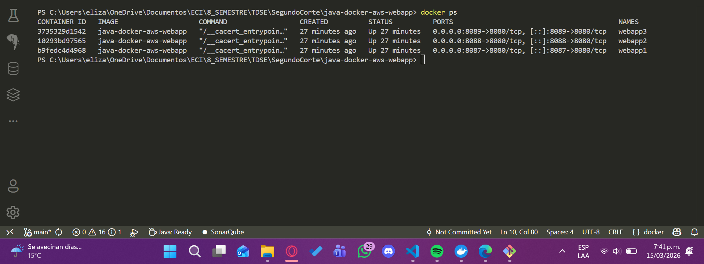

**5. Test the endpoints in the browser:**

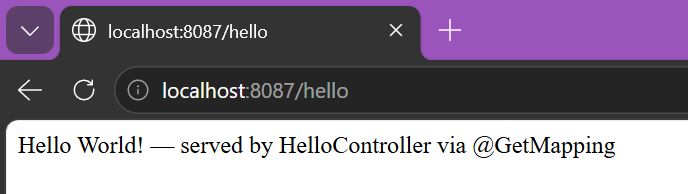
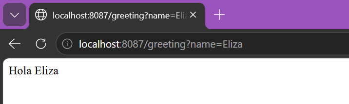
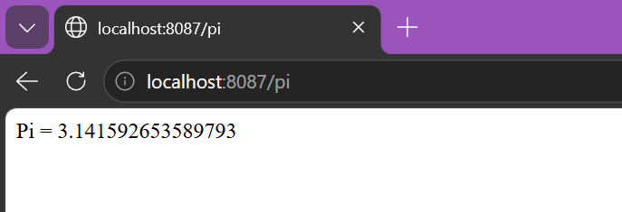

---

## 8. DockerHub

**1. Tag the image with your DockerHub username:**
```bash
docker tag java-docker-aws-webapp elizac05/java-docker-aws-webapp
```

**2. Login to DockerHub:**
```bash
docker login
```

**3. Push the image:**
```bash
docker push elizac05/java-docker-aws-webapp:latest
```

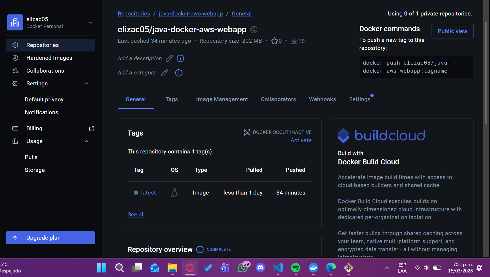

---

## 9. AWS EC2 Deployment

**1. Connect to the EC2 instance via SSH:**
```bash
ssh -i "AppServerKey.pem" ec2-user@ec2-3-236-14-121.compute-1.amazonaws.com
```

**2. Start Docker and configure user permissions:**
```bash
sudo service docker start
sudo usermod -a -G docker ec2-user
```

Disconnect and reconnect for the group change to take effect.

**3. Pull the image from DockerHub:**
```bash
docker pull elizac05/java-docker-aws-webapp
```

**4. Run the container:**
```bash
docker run -d -p 42000:8080 --name webapp-aws elizac05/java-docker-aws-webapp
```

**5. Verify the container is running:**
```bash
docker ps
```

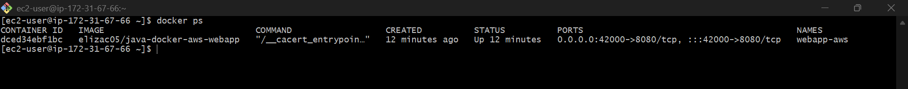

**6. Open port 42000 in the EC2 Security Group:**

Add an inbound rule: Custom TCP, port 42000, source 0.0.0.0/0.

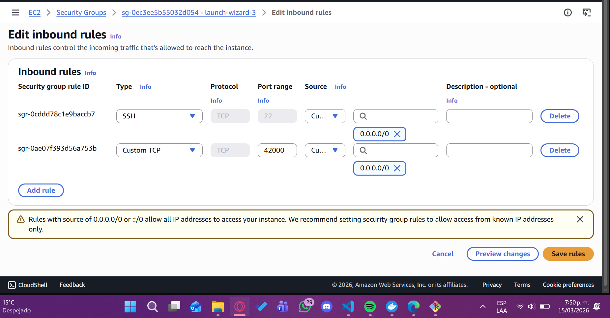

**7. Test the endpoints:**

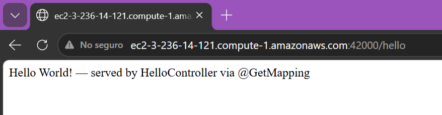
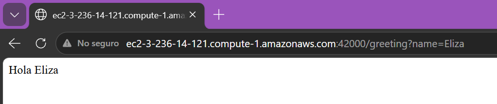
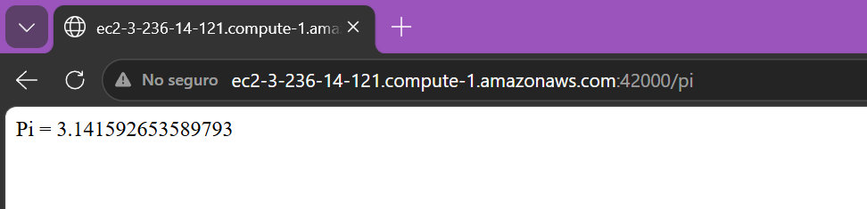

---

## 10. Available Endpoints

### Local

| Method | URL | Description |
|--------|-----|-------------|
| GET | `http://localhost:8087/hello` | Returns a hello message |
| GET | `http://localhost:8087/greeting?name=Eliza` | Returns a personalized greeting |
| GET | `http://localhost:8087/greeting/count?name=Eliza` | Returns greeting with request counter |
| GET | `http://localhost:8087/pi` | Returns the value of Pi |
| GET | `http://localhost:8087/euler` | Returns the value of Euler's number |
| GET | `http://localhost:8087/square?num=5` | Returns the square of a number |

### AWS EC2

| Method | URL | Description |
|--------|-----|-------------|
| GET | `http://ec2-3-238-240-131.compute-1.amazonaws.com:42000/hello` | Returns a hello message |
| GET | `http://ec2-3-238-240-131.compute-1.amazonaws.com:42000/greeting?name=Eliza` | Returns a personalized greeting |
| GET | `http://ec2-3-238-240-131.compute-1.amazonaws.com:42000/pi` | Returns the value of Pi |
| GET | `http://ec2-3-238-240-131.compute-1.amazonaws.com:42000/euler` | Returns Euler's number |
| GET | `http://ec2-3-238-240-131.compute-1.amazonaws.com:42000/square?num=5` | Returns the square of a number |

---

## 11. Concurrency

The previous version of this framework handled requests sequentially — one at a time. This version introduces concurrent request handling using a fixed thread pool.

**Key changes in `HttpServer.java`:**
```java
private static final int THREAD_POOL_SIZE = 10;
private static volatile boolean running = true;

ExecutorService threadPool = Executors.newFixedThreadPool(THREAD_POOL_SIZE);

while (running) {
    Socket client = serverSocket.accept();
    threadPool.submit(() -> handleClient(client));
}
```

Each incoming connection is dispatched to a worker thread from the pool, allowing up to 10 requests to be processed simultaneously. The `volatile` flag ensures visibility across threads when the server is shutting down.

The concurrency test launches 10 simultaneous requests and verifies all receive a `200 OK` response:

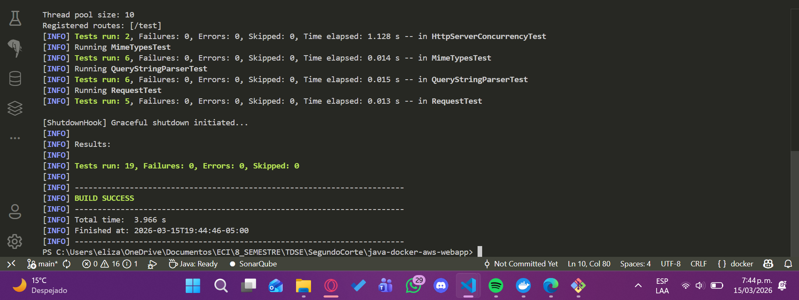

---

## 12. Graceful Shutdown

The server registers a JVM `ShutdownHook` that activates when a termination signal is received (e.g., `docker stop`, `Ctrl+C`).
```java
Runtime.getRuntime().addShutdownHook(new Thread(() -> {
    System.out.println("[ShutdownHook] Graceful shutdown initiated...");
    running = false;
    threadPool.shutdown();
    try {
        if (!threadPool.awaitTermination(5, TimeUnit.SECONDS)) {
            threadPool.shutdownNow();
        }
    } catch (InterruptedException e) {
        threadPool.shutdownNow();
        Thread.currentThread().interrupt();
    }
    System.out.println("[ShutdownHook] Server stopped gracefully.");
}));
```

**Shutdown flow:**

1. `docker stop` sends `SIGTERM` to the JVM.
2. The JVM activates the registered `ShutdownHook`.
3. The hook sets `running = false`, stopping the accept loop.
4. `threadPool.shutdown()` stops accepting new tasks.
5. The server waits up to 5 seconds for in-flight requests to complete.
6. The server exits cleanly.

**Evidence:**

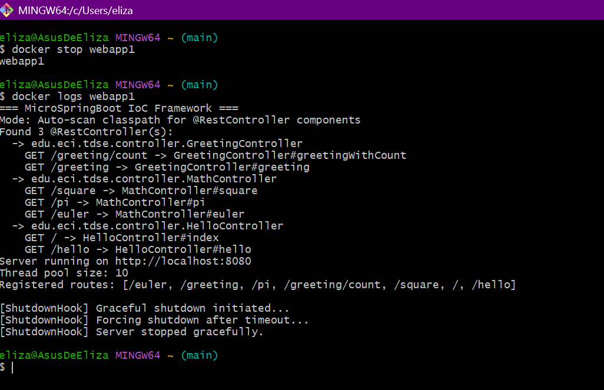

---

## 13. Tests

The project includes unit and integration tests covering all major components:

| Test class | What it tests |
|------------|---------------|
| `ComponentScannerTest` | Annotation detection and reflection invocation |
| `GreetingControllerTest` | Controller logic and request counter |
| `HttpServerConcurrencyTest` | 10 concurrent requests all return 200 OK |
| `MimeTypesTest` | MIME type resolution by file extension |
| `QueryStringParserTest` | Query string parsing including encoded values |
| `RequestTest` | HttpRequest parameter resolution |

Run all tests with:
```bash
mvn test
```


---

## 14. Deployment Demo — Video

<video controls width="720">
    <source src="images/Video_Despliegues.mp4" type="video/mp4">
</video>

The video shows the complete deployment process locally and on AWS EC2, including endpoint verification, concurrent request handling, and graceful shutdown demonstration.

---

## Author

**Elizabeth Correa Suarez**

---

